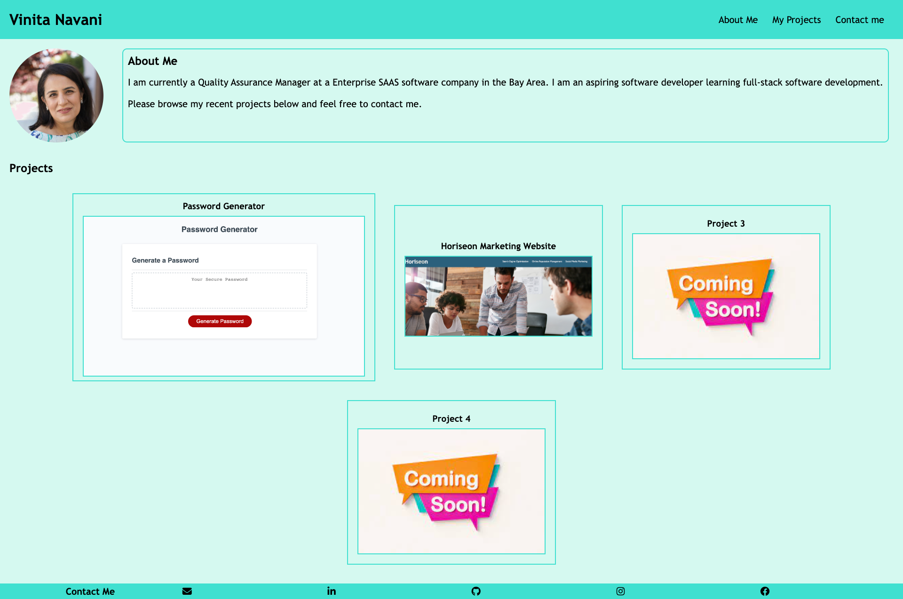

# Portfolio

## Description

Built my personal web portfolio which will showcase my projects which I will be doing in my coding bootcamp.

- It has my name and navigation links to About Me, My Projects and Contact info on the header.
- When clicking of any navigation links About Me, My Projects and Contact info takes the user to the respective section on the page.
- The About Me has my photo and a small section about me.
- The second section on the page is my Projects.
    - Each project is shown in an individual card.
    - It has heading and image for each project.
    - One of cards is bigger then the rest of the cards.
    - When clicking on the individual card it redirects to the project page.
    - Some of my current projects are just placeholders for future projects and will redirect to google.com
    - When hovering over individual cards the background color changes.
- The footer section consists of the Contact Me section and has links to my email, Linkedin, Github, Facebook and Instagram. I used help from this website to create my [Icon Bar](https://www.w3schools.com/howto/howto_css_icon_bar.asp/). I am also using icons from this site: [Font Awesome](https://fontawesome.com/)
- The page is responsive to screen sizes.

# Screenshots

# Link

[Link to Github Repository](https://github.com/vini3076/Challenge_2_Web_Portfolio)

[Link to Deployed page](https://vini3076.github.io/Challenge_2_Web_Portfolio/)
